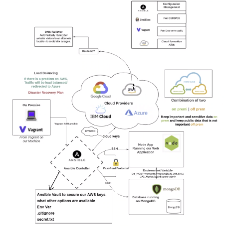

# Infrastructure as code with Ansible on AWS

## Securing AWS keys with Ansible Vault
- Ansible vault is a tool that is password proctect and generates an encrypted file where you can store keys.

- Encyption is important because if you accidently expose your vault file it is still encrypted. This has not protected you from that file getting view but it has bought you some time. Time is important.

## Securing AWS access and secret keys with Ansible Vault:

### Prerequisites
```python
sudo apt-get update -y
sudo apt-get install tree -y
sudo apt-add-repository --yes --update ppa:ansible/ansible
sudo apt install ansible -y
sudo apt install python3-pip - Python Package Manager
cd /etc/ansible
sudo apt install python3-pip
sudo pip3 install awscli
sudo pip3 install boto boto3 botocore
# Verify ansible aws module has been installed:
aws --version
# aws-cli/1.20.17 Python/3.6.9 Linux/4.15.0-151-generic botocore/1.21.17
sudo apt-get update -y
sudo apt-get upgrade -y
# we need to create a folder structure
sudo mkdir group_vars
cd group_vars
sudo mkdir all
cd all
#check current location
pwd
# /etc/ansible/group_vars/all
# Storing keys with Ansible vault
# Use ansible vault to create a .yml file which will store aws access and secret keys
sudo ansible-vault create pass.yml
# Once open type in a password then add following(after pressing 'i' to insert):
aws_access_key: THISISMYACCESSKEY
aws_secret_key: THISISMYSECRETKEY
# Note: To save changes in vim press 'esc' and type :wq! and press enter

# Once saved, all the content will be encrypted. To verify, type in the following:
sudo cat pass.yml
```
### Generate SSH key in your controller machine inside
```
~/.ssh/eng89_devops.pem 
#generate a new pair of ssh keys (ssh-keygen -t rsa -b 4096 -f ~/.ssh/eng89_devops)
~/.ssh/eng89_devops (this is the private key)
~/.ssh/eng89_devops.pub
sudo chmod 600 eng89_devops.pem
```
## Creating EC2 instance with Ansible
### This playbook will launch and EC2 with specific configuration of VPC-Subnet-region with public IP enabled
```
cd ..
cd ..
# write a playbook for create_ec2.yml as below (/etc/ansible)
---
- hosts: localhost
  connection: local
  gather_facts: True
  become: True
  vars:
    key_name: eng89_devops
    region: eu-west-1
    image:  ami-038d7b856fe7557b3
    id: "Ansilble lesson for AWS"
    sec_group: "sg-076b7682bb889a53e"
    subnet_id: "subnet-0cde00dfe9c771258"
# add the following line if ansible by default uses python 2.7
    ansible_python_interpreter: /usr/bin/python3
  tasks:

    - name: Facts
      block:

      - name: Get instances facts
        ec2_instance_facts:
          aws_access_key: "{{aws_access_key}}"
          aws_secret_key: "{{aws_secret_key}}"
          region: "{{ region }}"
        register: result

    
    - name: Provisioning EC2 instances
      block:

      - name: Upload public key to AWS
        ec2_key:
          name: "{{ key_name }}"
          key_material: "{{ lookup('file', '~/.ssh/{{ key_name }}.pub') }}"
          region: "{{ region }}"
          aws_access_key: "{{aws_access_key}}"
          aws_secret_key: "{{aws_secret_key}}"


      - name: Provision instance(s)
        ec2:
          aws_access_key: "{{aws_access_key}}"
          aws_secret_key: "{{aws_secret_key}}"
          assign_public_ip: true
          key_name: "{{ key_name }}"
          id: "{{ id }}"
          vpc_subnet_id: "{{ subnet_id }}"
          group_id: "{{ sec_group }}"
          image: "{{ image }}"
          instance_type: t2.micro
          region: "{{ region }}"
          wait: true
          count: 1
          instance_tags:
            Name: eng89_prathima_ansible_playbook

      tags: ['never', 'create_ec2']
```
### make sure you are in /etc/ansible folder and run the below command to create ec2 instance on aws (run playbooks on the cloud)
`sudo ansible-playbook create_ec2.yml --ask-vault-pass --tags create_ec2`
### enter the password created for the vault
### Now you will see amazing 'eng89_prathima_ansible_playbook' ec2 instance created and running.

#### Ping the EC2 from the controller
```
# add the public ip address of the ec2 instance into hosts in the controller
sudo nano hosts
[aws]
ec2-instance ansible_host=54.171.254.185 ansible_user=ubuntu ansible_ssh_private_key_file=~/.ssh/eng89_devops.pem
# ping the ec2 instace

```
## Nginx reverse proxy playbook
  - nginx setup playbook on web with reverse proxy
### Note - ensure the node-app and mongodb required dependencies are available in the specified location
```
---

    - hosts: web
    
      gather_facts: true
    
      become: true
    
      tasks:
      - name: Install nginx
        apt: pkg=nginx state=present
        become_user: root
    
      - name: Remove nginx default file (delete file)
        file:
          path: /etc/nginx/sites-enabled/default
          state: absent
    
      - name: Touch a file, using symbolic modes to set the permissions (equivalent to 0644)
        file:
          path: /etc/nginx/sites-enabled/reverseproxy.conf
          state: touch
          mode: '666'
    
    
      - name: Insert multiple lines and Backup
        blockinfile:
          path: /etc/nginx/sites-enabled/reverseproxy.conf
          block: |
            server{
              listen 80;
              server_name development.local;
              location / {
                  proxy_pass http://127.0.0.1:3000;
              }
            }
      - name: Create a symbolic link
        file:
          src: /etc/nginx/sites-enabled/reverseproxy.conf
          dest: /etc/nginx/sites-available/reverseproxy.conf
          state: link
    
      - name: nginx bug workaround
        shell: |
          sudo mkdir /etc/systemd/system/nginx.service.d
            printf "[Service]\nExecStartPost=/bin/sleep 0.1\n" | \
              sudo tee /etc/systemd/system/nginx.service.d/override.conf
          sudo systemctl daemon-reload
          sudo systemctl restart nginx
      ### Configuring Mongodb
      # mongodb_setup.yml
Note - Ensure the node-app and mongodb required dependencies are available in the specified location
---

    - hosts: db
    
      gather_facts: yes
    
      become: true
    
      tasks:
      - name: install mongodb
        apt: pkg=mongodb state=present
    
      - name: Remove mongodb file (delete file)
        file:
          path: /etc/mongodb.conf
          state: absent
    
      - name: Touch a file, using symbolic modes to set the permissions (equivalent to 0644)
        file:
          path: /etc/mongodb.conf
          state: touch
          mode: u=rw,g=r,o=r
    
    
      - name: Insert multiple lines and Backup
        blockinfile:
          path: /etc/mongodb.conf
          block: |
            # mongodb.conf
            storage:
              dbPath: /var/lib/mongodb
              journal:
                enabled: true
            systemLog:
              destination: file
              logAppend: true
              path: /var/log/mongodb/mongod.log
            net:
              port: 27017
              bindIp: 0.0.0.0
      - name: Restart mongodb
        become: true
        shell: systemctl restart mongodb
    
      - name: enable mongodb
        become: true
        shell: systemctl enable mongodb
    
      - name: start mongodb
        become: true
        shell: systemctl start mongodb
    ### Configuring nodeapp and importing mongodb playbook

    # node_app_playbook.yml
This is a YAML file to install node-app onto our web using YAML
--- 


- name: start mongodb
  import_playbook: mongodb_setup.yml


# where do we want to install


#  tasks:
- name: Install nginx
  import_playbook: nginx_setup.yml


# Install node js and NPM

- hosts: web
  gather_facts: true
  become: true


  tasks:
  - name: Install nodejs
    apt: pkg=nodejs state=present

  - name: Install NPM
    apt: pkg=npm state=present

  - name: download latest npm + Mongoose
    shell: |
      npm install -g npm@latest
      npm install mongoose -y
# Downloading pm2
  - name: Install pm2
    npm:
      name: pm2
      global: yes


  - name: seed + run app
    shell: |
      cd app/
      npm install
      node seeds/seed.js
      pm2 kill
      pm2 start app.js
    environment:
# This is where you enter the environment variable to tell the app where to look for the db
      DB_HOST: mongodb://ubuntu@<ENTER DB IP HERE>:27017/posts?authSource=admin
    become_user: root
```